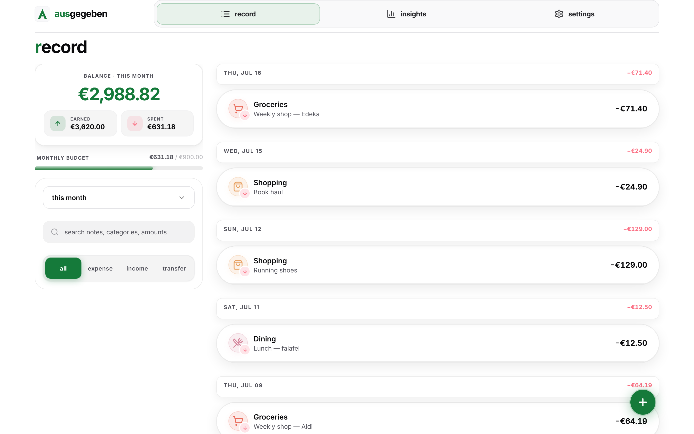
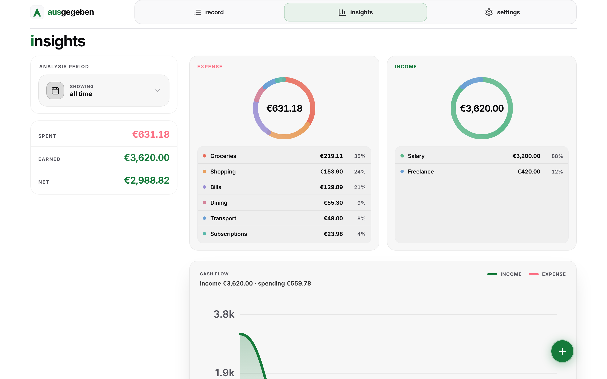
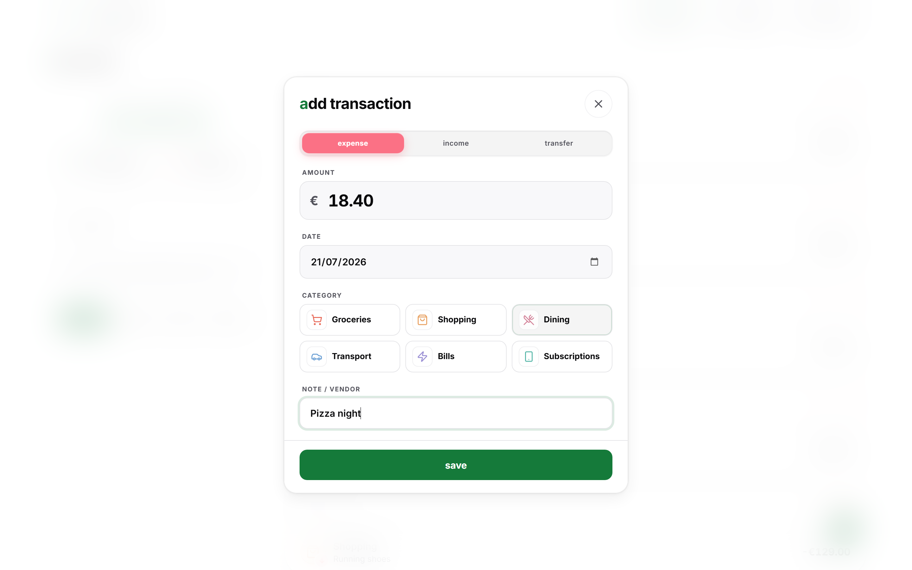
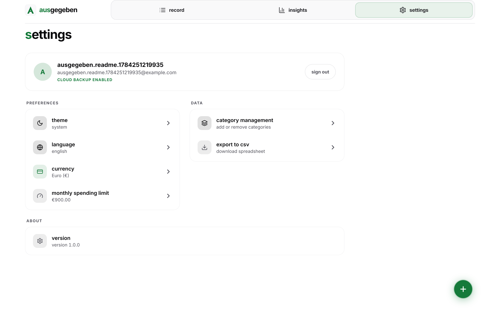
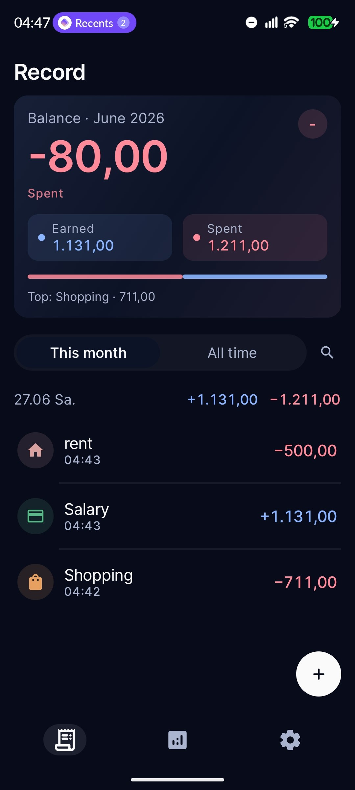
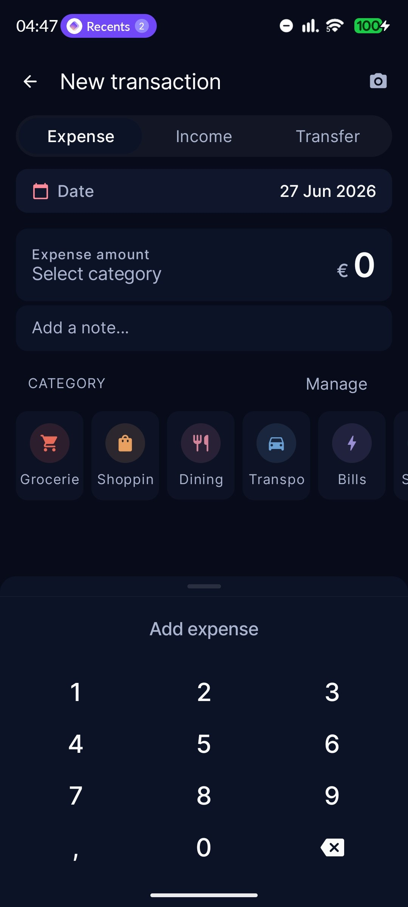
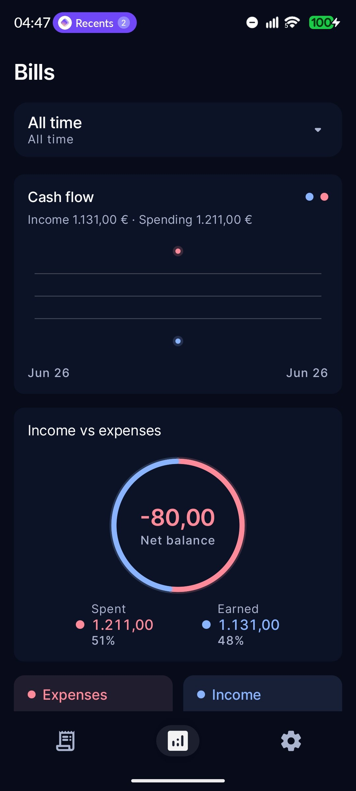
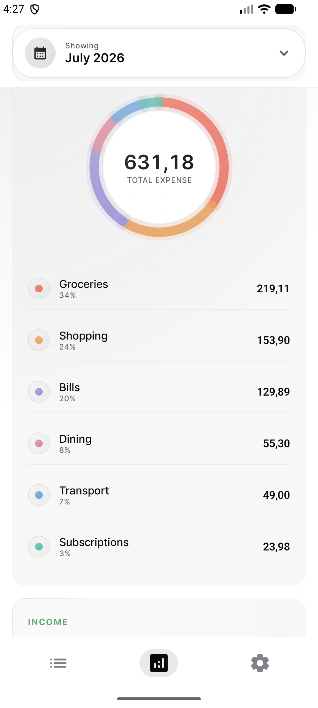
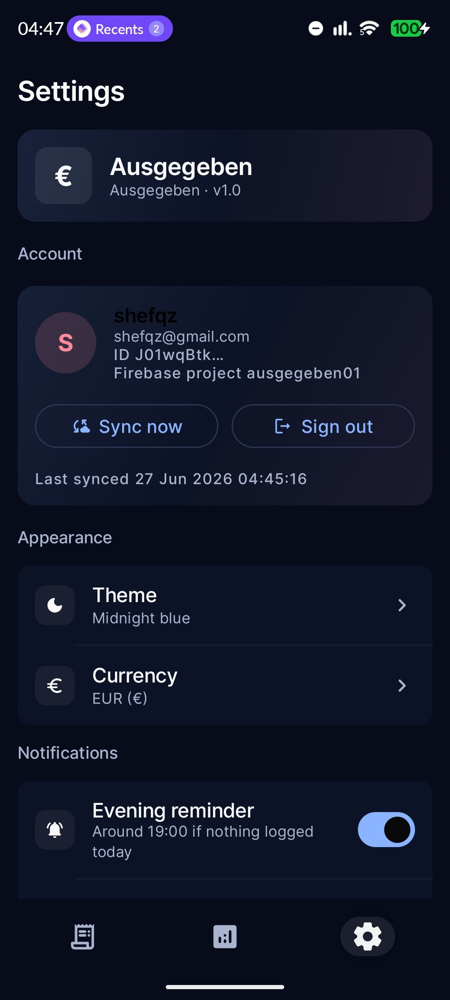
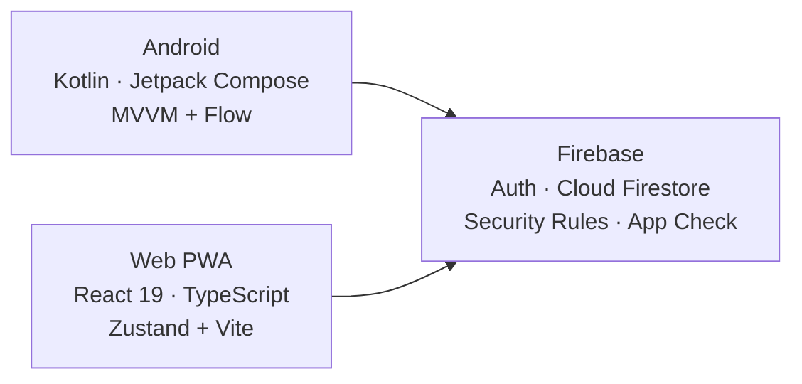

# Ausgegeben

*German for "spent"* — a personal finance tracker for **Android** and the **web**, sharing one Firebase backend so your data follows you across devices in real time.

[](https://github.com/shareef01/ausgegeben/actions/workflows/ci.yml)


**Try it now:** [aus01.web.app](https://aus01.web.app) · installable as a PWA

- **Track** expenses, income, and transfers with notes and custom categories
- **Understand** your money — budgets, category breakdowns, cash-flow trends
- **Everywhere** — add a transaction on your phone, see it on the web instantly
- **Private by design** — no analytics, per-user data isolation, CSV export so you're never locked in
- **Free to run** — engineered to stay within Firebase's free Spark tier

---

## Screenshots

### Web

| Record | Insights |
|---|---|
|  |  |

| Add Transaction | Settings |
|---|---|
|  |  |

### Android

<p align="center">
  
  
  
  
  
</p>

---

## Features

| | |
|---|---|
| **Transactions** | Expense / income / transfer with notes, undo-able delete, duplicate, search |
| **Categories** | Full CRUD with a curated icon & color library; safe deletion reassigns orphaned transactions |
| **Insights** | Real-time balance, monthly budget bar, per-category donut charts, cash-flow graph, flexible analysis periods |
| **Sync** | Firebase Auth + Cloud Firestore; preferences (theme, locale, currency, budget, reminders) sync cross-device with last-write-wins |
| **Personalization** | 10 theme modes (system / light / dark / AMOLED / …), English & German localization |
| **Reminders** | Daily notification at a configurable time (WorkManager, survives reboots) |
| **Portability** | One-tap CSV export on both platforms, with spreadsheet-injection-safe escaping |

---

## Architecture

Two native-feeling clients, one serverless backend. There is no custom API server — security lives in Firestore rules, validated field-by-field.



**Android** — 100% Jetpack Compose on Material 3 with a custom design system. Clean MVVM: cold Firestore listener flows keyed to auth state, exposed as `StateFlow` to lifecycle-aware UI. Firestore's offline cache keeps the app usable without a connection; DataStore holds local preferences.

**Web** — React 19 + TypeScript, built with Vite. In-memory Zustand stores fed by the same Firestore documents and rules as Android, down to identical starter categories and color values. Installable PWA with a precached shell.

**Backend** — Email/password Firebase Auth (with App Check: Play Integrity on Android, reCAPTCHA Enterprise on web). Every document lives under `users/{uid}/…` and the [security rules](firestore.rules) enforce both ownership and schema (types, ranges, string lengths). Queries are range-scoped to stay inside Spark-tier read quotas.

---

## Getting Started

**Prerequisites:** JDK 17 + Android Studio (Android) · Node.js 20+ (web) · a Firebase project — see **[FIREBASE_SETUP.md](FIREBASE_SETUP.md)** for the 5-minute walkthrough.

### Android

```bash
# Place your Firebase config first: app/google-services.json
./gradlew assembleDebug          # build
./gradlew testDebugUnitTest      # unit tests
```

A placeholder `google-services.json` is generated automatically so the project compiles out of the box; real sign-in needs your own. Android Studio specifics: [ANDROID_STUDIO.md](ANDROID_STUDIO.md).

### Web

```bash
cd web
cp .env.example .env.local       # fill in your Firebase web config
npm install
npm run dev                      # http://localhost:5173
npm test                         # vitest
npm run deploy                   # build + deploy hosting & Firestore rules
```

More detail in [web/README.md](web/README.md).

---

## Quality

- **CI** ([workflow](.github/workflows/ci.yml)): every push and PR runs Android unit tests + debug build, and web type-check, tests, `npm audit`, and production build.
- **Static safety:** strict TypeScript, schema-validating Firestore rules, R8-minified releases.
- **Hosting hardening:** CSP without inline scripts, HSTS, frame-ancestors denial, restrictive Permissions-Policy ([firebase.json](firebase.json)).
- **Privacy:** no third-party analytics or trackers of any kind.

---

## Project Structure

```
ausgegeben/
├── app/                 # Android app — Kotlin, Compose, WorkManager
├── web/                 # Web PWA — React, TypeScript, Vite
├── docs/screenshots/    # README screenshots (android/ + web/)
├── firestore.rules      # Per-user isolation + field-level schema validation
├── firebase.json        # Hosting config, security headers, rules deployment
├── scripts/             # Maintenance utilities
└── .github/workflows/   # CI for both platforms
```

---

## Author

**[Shareef](https://github.com/shareef01)** — Full Stack Android Developer
