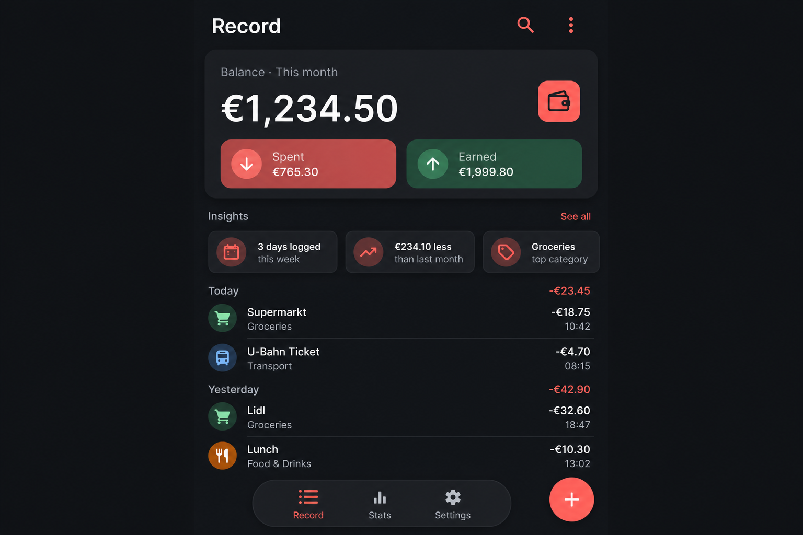
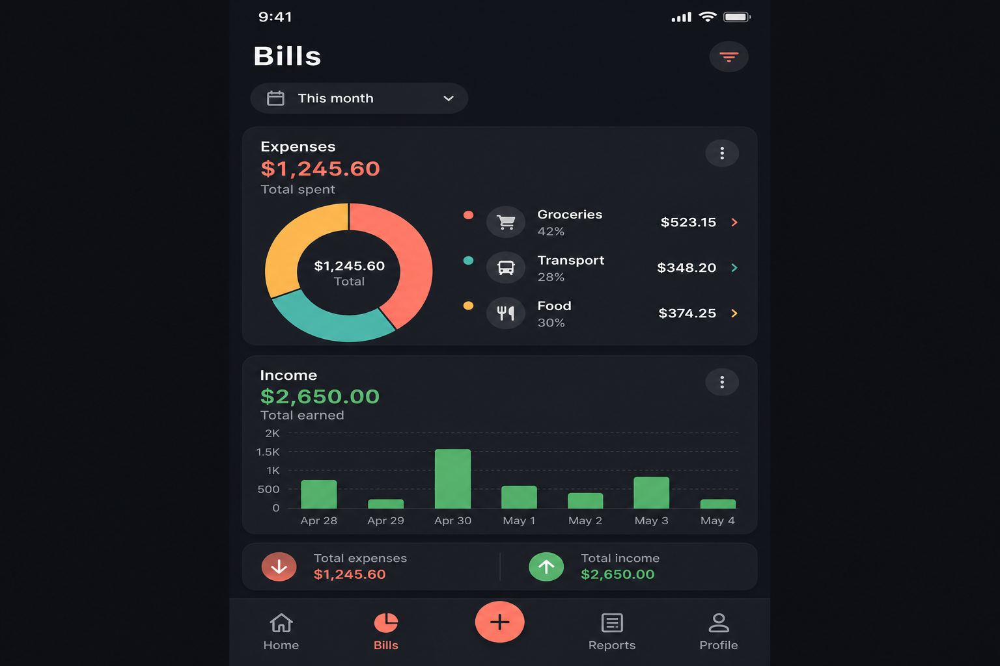
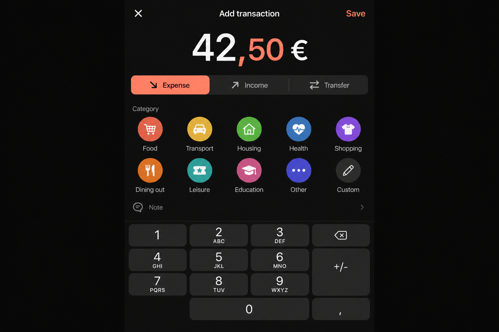
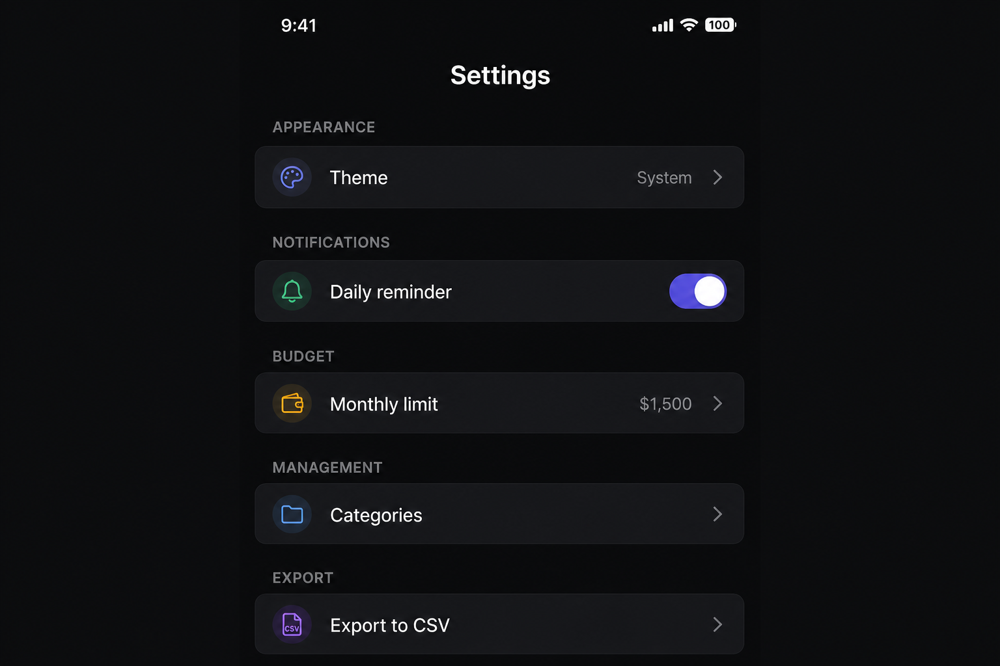

# Ausgegeben

**Ausgegeben** (*German for “spent”*) is a privacy-first, offline personal finance tracker for Android. Log expenses, income, and transfers; attach receipt photos; review spending charts; and stay on budget — all without an account or cloud sync.

<p align="center">
  
  
  
  
</p>

---

## Features

| Area | What you get |
|------|----------------|
| **Transactions** | Expenses, income, and transfers with notes, dates, and custom categories |
| **Record tab** | Balance summary, insights strip, monthly budget progress, searchable paged list |
| **Bills tab** | Donut and bar charts by category for expenses, income, and transfers |
| **Receipts** | Capture photos with CameraX; thumbnails on transactions; cleanup on delete |
| **Categories** | Full CRUD with icons, colors, reordering, and per-type grouping |
| **Budget** | Optional monthly spending cap with on-screen progress |
| **Reminders** | Daily WorkManager notifications (permission requested only when enabled) |
| **Export** | CSV export of your data |
| **Onboarding** | Short 3-step first-run guide |
| **i18n** | English and German (`values` / `values-de`) |
| **Themes** | System, Light, or Dark |
| **Offline** | Room SQLite database on device — no network required |

### UX highlights

- Swipe-to-delete with confirmation dialog and undo snackbar
- Long-press to duplicate a transaction (receipt preserved)
- Icon-only bottom navigation with swipe-between-tabs pager
- Locale-aware currency formatting and decimal keypad (`,` / `.`)
- Notification deep link opens the add-transaction flow

---

## Screenshots

### Record
Transaction history grouped by day, finance summary card, spending insights, and budget bar.


### Bills
Category breakdown charts for the selected analytics period.


### Add transaction
Amount keypad, type selector, category grid, and optional receipt capture.


### Settings
Theme, reminders, budget, categories, export, and about.


---

## Tech stack

| Layer | Technology |
|-------|------------|
| Language | **Kotlin** |
| UI | **Jetpack Compose** + **Material 3** |
| Architecture | **MVVM** — ViewModels, Repository, Room DAOs |
| Navigation | **Navigation 3** with custom tab pager |
| Database | **Room 2.7** (schema v6, exported migrations v1→v6) |
| Lists | **Paging 3** for large transaction histories |
| Preferences | **DataStore** (theme, currency, budget, onboarding) |
| Background work | **WorkManager** for daily reminders |
| Camera | **CameraX** + **Coil** for receipt images |
| Permissions | **Accompanist Permissions** (deferred camera / notification prompts) |
| Build | **AGP 9.2**, **KSP**, **Kotlin 2.2**, **Compose BOM** |
| Release | R8 minify + shrink resources, ProGuard rules |
| Tests | JUnit unit tests; Room migration instrumented tests |

### Project structure

```
app/src/main/java/com/aus/ausgegeben/
├── data/           # Room DB, DAOs, repository, paging, migrations
├── notification/   # Reminders, boot receiver, WorkManager worker
├── ui/             # Screens, ViewModels, navigation, theme
└── util/           # Currency, dates, export, category helpers
```

---

## Requirements

- **Android 12+** (API 31+)
- **Android Studio** Ladybug or newer (or compatible IDE with AGP 9.2)
- **JDK 17** (Android Studio bundled JBR works)

---

## Getting started

### Clone

```bash
git clone https://github.com/shareef01/ausgegeben.git
cd ausgegeben
```

### Build & run

```bash
# Windows (PowerShell) — point JAVA_HOME at Android Studio's JBR if needed
$env:JAVA_HOME = "C:\Program Files\Android\Android Studio\jbr"
.\gradlew.bat assembleDebug
```

Install the APK from `app/build/outputs/apk/debug/` or run from Android Studio on a device/emulator.

### Tests

```bash
.\gradlew.bat testDebugUnitTest
.\gradlew.bat assembleDebugAndroidTest
# On a connected device/emulator:
.\gradlew.bat connectedDebugAndroidTest
```

---

## Database migrations

Room schema is exported to `app/schemas/` for migration validation. Upgrades from v1 through v6 are handled in `DatabaseMigrations.kt` with idempotent SQL. Downgrade uses destructive migration only when the app version regresses.

---

## Privacy

Ausgegeben stores all data locally on your device. There is no analytics SDK, no sign-in, and no data leaves your phone unless you explicitly export CSV or share a receipt image through the system share sheet.

---

## License

This project is provided as-is for personal use. Add a license file if you plan to distribute or open-source under specific terms.

---

## Author

[shareef01](https://github.com/shareef01) — [ausgegeben](https://github.com/shareef01/ausgegeben)
