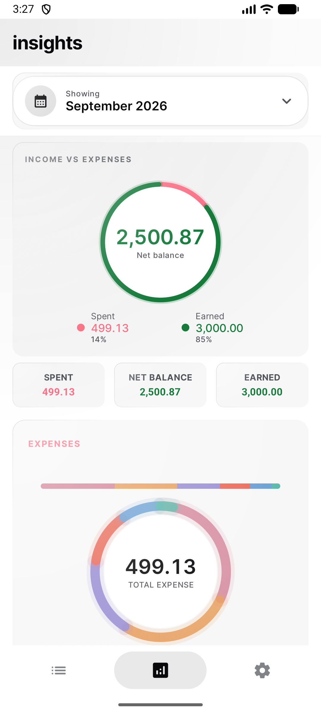

# Ausgegeben

**A straightforward personal finance tracker for Android and the web.**

Ausgegeben keeps expenses, income, transfers, budgets, and spending trends in one place. It is designed for everyday use: quick to update, useful offline, and consistent across phone and browser.

[Use the web app](https://aus01.web.app) · [Download the Android app](https://github.com/shareef01/ausgegeben/releases/latest)

[](https://github.com/shareef01/ausgegeben/releases/latest)
[](https://github.com/shareef01/ausgegeben/actions/workflows/ci.yml)
[](LICENSE)

## A quick look

### Web

<p>
  <picture>
    <source media="(prefers-color-scheme: dark)" srcset="docs/screenshots/web/web-record-dark.png">
    <source media="(prefers-color-scheme: light)" srcset="docs/screenshots/web/web-record-light.png">
    
  </picture>
  <picture>
    <source media="(prefers-color-scheme: dark)" srcset="docs/screenshots/web/web-insights-dark.png">
    <source media="(prefers-color-scheme: light)" srcset="docs/screenshots/web/web-insights-light.png">
    
  </picture>
</p>

### Android

<p>
  <picture>
    <source media="(prefers-color-scheme: dark)" srcset="docs/screenshots/android/record-dark.png">
    <source media="(prefers-color-scheme: light)" srcset="docs/screenshots/android/record-light.png">
    
  </picture>
  <picture>
    <source media="(prefers-color-scheme: dark)" srcset="docs/screenshots/android/insights-dark.png">
    <source media="(prefers-color-scheme: light)" srcset="docs/screenshots/android/insights-light.png">
    
  </picture>
</p>

Every screenshot is generated from a verified demo account against local Firebase emulators. No personal financial data is used. The repeatable capture tools live in [`web/scripts`](web/scripts/capture-screenshots.mjs) and [`scripts`](scripts/capture-android-screenshots.mjs).

## What it does

- Records expenses, income, and transfers with notes and custom categories
- Breaks down spending by category and visualizes cash flow over time
- Tracks a monthly spending limit and highlights budget progress
- Searches, duplicates, soft-deletes, restores, and exports transactions to CSV (with a versioned JSON backup format for disaster recovery)
- Synchronizes data and preferences between Android and the web
- Supports English and German, multiple currencies, and several light and dark themes
- Works offline through Firestore's local cache, with browser persistence controlled per device
- Provides configurable daily reminders on Android
- Installs as a PWA and updates its cached application shell automatically

## How it is built

| Platform | Main technologies | Distribution |
|---|---|---|
| Android | Kotlin, Jetpack Compose, Hilt, WorkManager, DataStore | Signed APKs on [GitHub Releases](https://github.com/shareef01/ausgegeben/releases) |
| Web | React, TypeScript, Vite, Zustand | [Firebase Hosting](https://aus01.web.app) as an installable PWA |
| Shared backend | Firebase Authentication and Cloud Firestore | Firebase Spark plan; no paid Cloud Functions dependency |
| Error reporting | Optional Cloudflare Worker endpoint | App Check validation and per-session client limits |

Both clients store cloud data below the authenticated user's Firestore document. Security rules enforce user isolation, verified-email writes, accepted document fields, and financial data constraints. Important operations such as category migration and account deletion are resumable and tested at batch boundaries.

## Privacy and security

Ausgegeben contains no advertising or analytics SDKs. Financial records are stored in the user's Cloud Firestore account and may be cached locally for offline access. Web authentication defaults to session-based persistence so shared computers do not retain account access across browser restarts; persistent login and offline financial data caching are decoupled opt-in settings. Signing out and account deletion attempt to clear local application data on both clients.

Optional web error reporting can send bounded technical diagnostics—including an error message, stack trace, page path, browser user-agent, and limited runtime context—to the project's Cloudflare Worker. It can be disabled in Settings. Account identifiers, authentication material, and financial fields are filtered before transmission.

The security model, operational constraints, and release procedure are documented in [Firebase setup](FIREBASE_SETUP.md), [audit remediation notes](docs/audit-remediation.md), and the [maintenance guide](docs/maintenance.md).

## Run it locally

### Android

Install Android Studio, Android SDK 37, and JDK 21. Add a real Firebase Android configuration at `app/google-services.json`, then run:

```powershell
.\gradlew.bat assembleProdDebug
.\gradlew.bat testProdDebugUnitTest
```

The committed example Firebase file is deliberately nonfunctional: it supports CI and local compilation without exposing production configuration. Signed release builds require the maintainer's Firebase and signing material. See [Android Studio setup](ANDROID_STUDIO.md) for the complete setup.

### Web

Install Node.js 22 or newer, copy `web/.env.example` to `web/.env.local`, and add your Firebase web configuration:

```bash
cd web
npm ci
npm run dev
```

See the [web development guide](web/README.md) for emulator, testing, and deployment details.

## Quality checks

```bash
# Web: unit tests, type checks, CSS validation, and production build
cd web
npm test
npm run lint
npm run lint:css
npm run build

# Firestore rules and repository integration tests (JDK 21+)
npm run test:rules
npm run test:emulator

# Android: unit tests, lint, and debug build (from the repository root)
./gradlew testProdDebugUnitTest lintProdDebug assembleProdDebug
```

CI also runs Android instrumentation tests. A semantic version tag runs every release gate again, builds and verifies the signed APK, launches that exact artifact on an emulator, and publishes it only after every check succeeds.

## Repository map

```text
app/                  Android application and tests
web/                  React PWA, Firestore tests, and web tooling
tools/error-endpoint/ Optional Cloudflare error-reporting Worker
docs/                 Maintenance, remediation, and product screenshots
scripts/              Cross-platform repository tooling
```

Generated builds, emulator state, local audit material, dependencies, Firebase configuration, and signing files are intentionally excluded from Git.

## Maintainer

Created and maintained by [shareef01](https://github.com/shareef01).

## License

Ausgegeben is available under the [MIT License](LICENSE).
